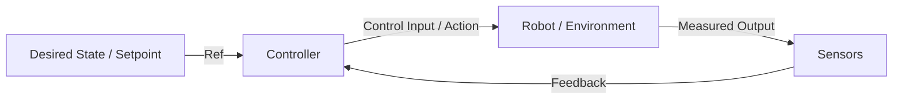

# Robot Controllers

A **Controller** is a core hardware or software component in robotic systems that determines the inputs (such as electrical current, voltage, or torque) required to steer a physical system (the plant) toward a desired state (the setpoint).

---

## The Control Loop

A standard controller operates inside a continuous loop, executing the following sequence:

1. **Sense**: Read sensor inputs (e.g. joint angles, camera frames, target position).
2. **Think**: Calculate the difference (error) between the desired state and current state.
3. **Act**: Apply the computed control commands (e.g. motor torques) to the actuators.

---

## Core Signals

- **Setpoint** ($r(t)$): The target state or reference coordinate we want the robot to reach.
- **Process Variable** ($y(t)$): The actual, measured state of the robot (e.g. current joint angle).
- **Control Output** ($u(t)$): The action or torque command output by the controller.
- **Error** ($e(t)$): The mathematical difference between the setpoint and process variable:
  $$e(t) = r(t) - y(t)$$
