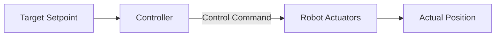

# Feedback Control Systems

A control system can be designed to operate in one of two configurations: **Open-Loop** or **Closed-Loop (Feedback)**.

---

## Open-Loop Control

In an **Open-Loop** control system, the control action is calculated entirely in advance based on a static assumption, and is applied without using any measurements of the system's output state.

### Characteristics:
- Simple to implement and design.
- Does not require sensors.
- Highly vulnerable to disturbances, modeling errors, and environmental changes.

*Example: Setting a kitchen timer for 10 minutes to bake a cake. The oven applies heat blindly without checking if the cake is actually baked.*

---

## Closed-Loop (Feedback) Control

In a **Closed-Loop** control system, the control action is dynamically adjusted in real-time based on the system's actual measured output, which is fed back as an input to the controller.

### Characteristics:
- Requires sensors (e.g. encoders, cameras).
- Can reject disturbances and compensate for modeling uncertainties.
- Must be tuned to prevent instability or oscillations.

*Example: An oven thermostat. It measures the internal temperature and turns the heating element on or off to maintain the target setpoint.*

---

## Comparative Summary

| Feature | Open-Loop Control | Closed-Loop (Feedback) Control |
| :--- | :--- | :--- |
| **Sensor Requirement** | None | Required (Feedback) |
| **Response to Disturbances**| Ignored (Open) | Corrected (Closed) |
| **Adaptability** | None (Static action) | Dynamic adjustment |
| **Complexity** | Low | Medium to High |
| **Robotics Suitability** | Poor (Except for calibration) | Excellent (Standard) |
