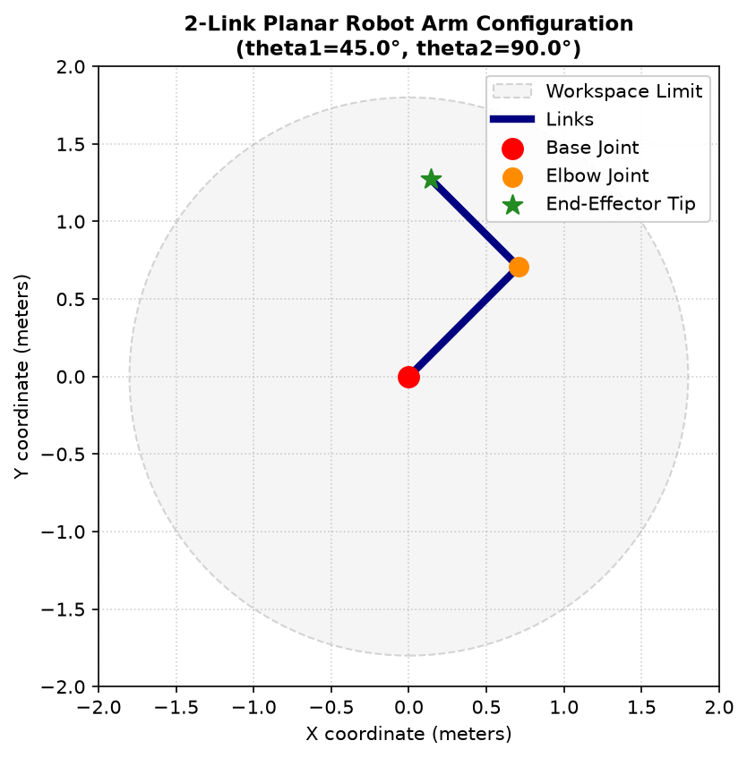

# Day 8 Journal: Forward Kinematics and 2-Link Robot Arm

- **Date**: 2026-07-11
- **Author**: Vishrao
- **Milestone**: Day 8 of VLA Learning Lab

---

## Objectives
1. Implement the mathematical equations for 2D Planar Forward Kinematics (FK).
2. Deconstruct how joint angles affect end-effector Cartesian coordinates.
3. Programmatically visualize a planar 2-link manipulator configuration.
4. Interface with workspace reachability boundaries.

---

## Theory

### Forward Kinematics Formula
For a serial 2-link planar arm operating in a 2D plane:
- $L_1$: Shoulder link length ($1.0\,\text{m}$)
- $L_2$: Elbow link length ($0.8\,\text{m}$)
- $\theta_1$: Shoulder angle (relative to the positive x-axis)
- $\theta_2$: Elbow angle (relative to Link 1 extension)

```text
                  Link 2 (L2)
                o===========* (x_tip, y_tip) End-Effector
               /  \
              /    \ Elbow Joint (\theta_2 relative to Link 1)
             /
            / Link 1 (L1)
           /
          / \
   Base  o   \ Shoulder Joint (\theta_1 relative to X-axis)
  (0,0)
```

The elbow coordinate $(x_{\text{elbow}}, y_{\text{elbow}})$:
$$x_{\text{elbow}} = L_1 \cos(\theta_1)$$
$$y_{\text{elbow}} = L_1 \sin(\theta_1)$$

The absolute angle of Link 2 relative to the base horizontal frame is $(\theta_1 + \theta_2)$. The end-effector tip coordinate $(x_{\text{tip}}, y_{\text{tip}})$:
$$x_{\text{tip}} = L_1 \cos(\theta_1) + L_2 \cos(\theta_1 + \theta_2)$$
$$y_{\text{tip}} = L_1 \sin(\theta_1) + L_2 \sin(\theta_1 + \theta_2)$$

---

## Lab Results

### Lab 18: Forward Kinematics
- **Setup**: Computed end-effector position for $L_1 = 1.0, L_2 = 0.8$, and default angles $\theta_1 = 45^\circ, \theta_2 = 90^\circ$.
- **Command**: `python week01/lab18_forward_kinematics.py`
- **Output**:
  ```text
  Link 1 Length : 1.0 m
  Link 2 Length : 0.8 m
  Theta1        : 45.0°
  Theta2        : 90.0°
  ------------------------------------------------------------
  Elbow Joint Coordinate : (+0.7071, +0.7071)
  End-Effector (X, Y)    : (+0.1414, +1.2728)
  ```

### Lab 19: Robot Arm Plotting
- **Setup**: Used `matplotlib` to plot link segments, joint nodes, and workspace reachability boundaries, saving the plot to `assets/day08/robot_arm.png`.
- **Command**: `python week01/lab19_plot_robot_arm.py`
- **Output Plot**:
  

---

## Exercise Results

### Exercise 1: Shoulder RotationSweep
- **Parameters**: $\theta_1$ swept from $45^\circ \to 90^\circ$ (with $\theta_2 = 90^\circ$ fixed).
- **Calculated Tip Position**:
  - at $\theta_1 = 45^\circ$: $(x_{\text{tip}}, y_{\text{tip}}) = (+0.1414, +1.2728)$
  - at $\theta_1 = 90^\circ$: $(x_{\text{tip}}, y_{\text{tip}}) = (-0.8000, +1.0000)$
- **Observations**:
  - **X coordinate decreased** (from $+0.1414$ to $-0.8000$).
  - **Y coordinate decreased** (from $+1.2728$ to $+1.0000$).
- **Explanation**: At $\theta_1 = 90^\circ$, Link 1 points straight up along the positive y-axis. Link 2 rotates a further $90^\circ$ relative to Link 1, placing it horizontally pointing left along the negative x-axis. The resulting end-effector tip coordinate is exactly $(-0.8, 1.0)$. Both X and Y decreased because the entire arm assembly pivoted counterclockwise into the second quadrant.

---

### Exercise 2: Elbow AngleSweep
- **Parameters**: Keeping $\theta_1 = 45^\circ$ fixed, $\theta_2$ swept through $0^\circ \to 30^\circ \to 60^\circ \to 90^\circ$.
- **Calculated Tip Coordinates**:
  - $\theta_2 = 0^\circ$: $(x, y) = (+1.2728, +1.2728)$
  - $\theta_2 = 30^\circ$: $(x, y) = (+0.9142, +1.4798)$
  - $\theta_2 = 60^\circ$: $(x, y) = (+0.5000, +1.4798)$
  - $\theta_2 = 90^\circ$: $(x, y) = (+0.1414, +1.2728)$
- **Observations**:
  - **End-effector movement**: The fingertip traces a circular arc of radius $L_2 = 0.8$ centered around the fixed elbow coordinate $(0.7071, 0.7071)$.
  - **Effect on X**: X decreased monotonically from $+1.2728 \to +0.1414$.
  - **Effect on Y**: Y first increased (reaching a peak of $+1.4798$ at $30^\circ$ and $60^\circ$) and then decreased back to $+1.2728$ at $90^\circ$.
  - **Why only Link 2 changes**: Because the shoulder joint angle $\theta_1$ is constant, Link 1 is stationary. The base and elbow coordinates do not move; only Link 2 pivots about the elbow.

---

### Exercise 3: Sensitivity Analysis
- **Observations**:
  - **How does the arm move?**: The base joint rotates the entire manipulator assembly. The elbow joint rotates only the second link relative to the first.
  - **Which joint affects the end-effector most?**: The shoulder joint ($\theta_1$).
  - **Why?**: A change in $\theta_1$ moves the entire kinematic chain, pivoting the end-effector along a large radius arc of length $L_1 + L_2$. Conversely, a change in $\theta_2$ only pivots Link 2, moving the end-effector along a smaller radius arc of length $L_2$. Thus, the end-effector coordinate position is more sensitive to shoulder joint adjustments.

---

## Engineering Insights
- **Workspace Bounds**: A 2-link planar arm has a reachable workspace bounded by $R_{\max} = L_1 + L_2$ (outer radius) and $R_{\min} = |L_1 - L_2|$ (inner radius). Coordinates outside this annulus are unreachable.
- **Trigonometric Projective Continuity**: Representing joint angles as sine/cosine coords allows computing forward kinematics algebraically without using expensive and discontinuous inverse trigonometric functions.

---

## Commands Used
```bash
# Compute Forward Kinematics
python week01/lab18_forward_kinematics.py

# Visualize Configuration
python week01/lab19_plot_robot_arm.py
```

---

## Issues Encountered & Solutions
- **Issue**: Standard `matplotlib.pyplot.show()` calls raise GUI rendering errors in headless execution environments.
- **Solution**: Set the non-interactive backend `matplotlib.use('Agg')` prior to plotting to save the configuration directly to a PNG file.

---

## Glossary & Interview Links
- Glossary terms added to [docs/glossary.md](file:///C:/Users/Vishrao/vla-lab/vla-lab/docs/glossary.md): Link, Joint, Workspace, Serial Manipulator, Robot Geometry, Reachability.
- Q&As added to [docs/interview_questions.md](file:///C:/Users/Vishrao/vla-lab/vla-lab/docs/interview_questions.md).

---

## Reflection
Forward kinematics is the foundation of robotic state feedback. Without accurate link measurements and joint encoders, closed-loop controllers cannot compute the target error vector.

---

## Next Steps
Day 9: Implement Inverse Kinematics (IK) and connect Forward Kinematics to trajectory path planning.
