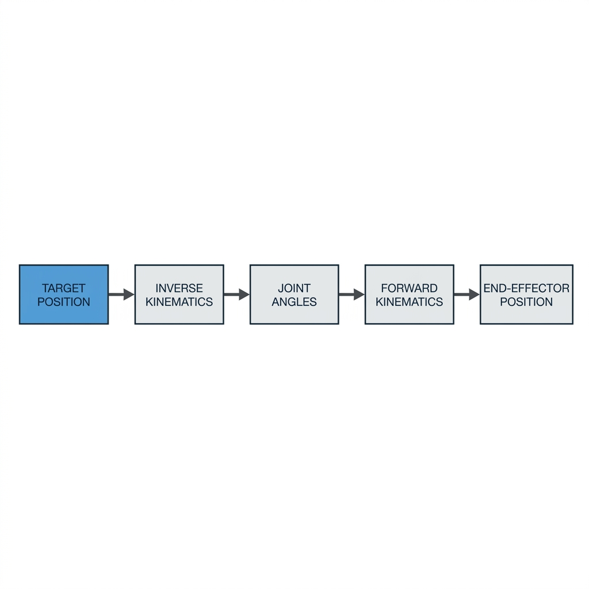

# Day 9 Journal: Inverse Kinematics and IK Verification

- **Date**: 2026-07-13
- **Author**: Vishrao
- **Milestone**: Day 9 of VLA Learning Lab

---

## Objectives
1. Implement the mathematical formulation of 2D Planar Inverse Kinematics (IK).
2. Compute joint configurations ($\theta_1, \theta_2$) corresponding to desired end-effector target positions.
3. Handle out-of-workspace targets using numerical clamping with `np.clip()`.
4. Validate IK accuracy by reconstructing position coordinates via Forward Kinematics (FK).
5. Contrast the Elbow-Up vs. Elbow-Down configurations.

---

## Theory

### Inverse Kinematics Overview
Given target coordinates $(x, y)$ and link lengths $L_1, L_2$, IK solves the joint configurations required to place the fingertip tip at $(x, y)$.

1. **Elbow Angle ($\theta_2$)**:
   Using the law of cosines:
   $$\cos(\theta_2) = \frac{x^2 + y^2 - L_1^2 - L_2^2}{2 L_1 L_2}$$
   $$\theta_2 = \pm \arccos\left(\cos(\theta_2)\right)$$
   - Positive sign ($+$) yields the **Elbow-Down** configuration.
   - Negative sign ($-$) yields the **Elbow-Up** configuration.
2. **Shoulder Angle ($\theta_1$)**:
   $$\theta_1 = \arctan2(y, x) - \arctan 2(L_2 \sin(\theta_2), L_1 + L_2 \cos(\theta_2))$$

---

## Flowchart Diagram
The signal flow of kinematics is illustrated below:



---

## Lab Results

### Lab 20: Inverse Kinematics
- **Setup**: Computed both Elbow-Down and Elbow-Up configurations for multiple Cartesian targets.
- **Command**: `python week01/lab20_inverse_kinematics.py`
- **Output**:
  ```text
  Target Coordinate : (+1.20, +0.80)
  Status            : REACHABLE
    - Elbow-Down Solution: theta1 = +1.46°, theta2 = +74.04°
    - Elbow-Up Solution  : theta1 = +65.92°, theta2 = -74.04°
  ---------------------------------------------------------------------------
  Target Coordinate : (+1.40, +0.20)
  Status            : REACHABLE
    - Elbow-Down Solution: theta1 = -25.32°, theta2 = +77.00°
    - Elbow-Up Solution  : theta1 = +41.58°, theta2 = -77.00°
  ```

### Lab 21: Verification Loop
- **Setup**: Solved IK for desired target $(1.2, 0.8)$ and verified it using FK equations.
- **Command**: `python week01/lab21_verify_ik.py`
- **Output**:
  ```text
  Target Coordinate      : (1.2000, 0.8000)
  Computed Joint Angles  : theta1 = +1.46°, theta2 = +74.04°
  Reconstructed Position : (1.2000, 0.8000)
  ------------------------------------------------------------
  Coordinate Error X     : +2.2204460492503131e-16 m
  Coordinate Error Y     : -1.1102230246251565e-16 m
  ```

---

## Exercise Results

### Exercise 1: Joint Angle Adjustments
- **Parameters**: Desired target shifted from $(1.2, 0.8) \to (1.4, 0.2)$.
- **Elbow-Down Solutions**:
  - Target $(1.2, 0.8)$: $\theta_1 = +1.46^\circ, \theta_2 = +74.04^\circ$
  - Target $(1.4, 0.2)$: $\theta_1 = -25.32^\circ, \theta_2 = +77.00^\circ$
- **Observations**:
  - **$\theta_1$ decreased** from $+1.46^\circ \to -25.32^\circ$.
  - **$\theta_2$ increased** from $+74.04^\circ \to +77.00^\circ$.
- **Explanation**:
  - $\theta_1$ mainly changes the direction of the arm. Since the new target is much lower (closer to horizontal, $y=0.2$ vs $y=0.8$), $\theta_1$ must decrease to rotate the first link downward.
  - $\theta_2$ mainly changes the elbow bend (overall shape), which dictates the radial distance of the tip from the base. The distance of target 1 is $\sqrt{1.2^2 + 0.8^2} \approx 1.44\,\text{m}$, whereas target 2 is closer at $\sqrt{1.4^2 + 0.2^2} \approx 1.41\,\text{m}$. Since target 2 is closer, the elbow joint must bend more (larger elbow angle $\theta_2$) to retract the tip.

---

### Exercise 2: Sweep Analysis
The table logs solved configurations across a sweep of Cartesian coordinates:

| Target (X, Y) | Distance (m) | theta1 (deg) | theta2 (deg) | Reachability |
| :--- | :--- | :--- | :--- | :--- |
| **(1.5, 0.2)** | 1.513 | $-21.29^\circ$ | $+66.03^\circ$ | REACHABLE |
| **(1.2, 0.8)** | 1.442 | $+1.46^\circ$ | $+74.04^\circ$ | REACHABLE |
| **(0.5, 1.2)** | 1.300 | $+29.42^\circ$ | $+88.21^\circ$ | REACHABLE |
| **(0.2, 1.5)** | 1.513 | $+53.52^\circ$ | $+66.03^\circ$ | REACHABLE |
| **(2.0, 2.0)** | 2.828 | $+45.00^\circ$ | $+0.00^\circ$ | UNREACHABLE (Clamped) |

---

### Exercise 3: Numerical Verification Error
- **Results**: Desired target $(1.200, 0.800)$, reconstructed actual tip position $(1.200, 0.800)$. Coordinate errors:
  - $e_x = +2.22 \times 10^{-16}\,\text{m}$
  - $e_y = -1.11 \times 10^{-16}\,\text{m}$
- **Reasoning**: The analytical inverse kinematics equations represent mathematically exact closed-form solutions. The tiny, non-zero errors are purely due to **floating-point precision roundoff limitations (machine epsilon)** in double-precision `float64` execution on the CPU.

---

## Engineering Insights
- **Boundary Clamping**: Guarding inverse kinematics equations using `np.clip(cos_theta2, -1.0, 1.0)` keeps the argument within arccos domain boundaries, preventing `NaN` exceptions and ensuring the solver fails gracefully by extending the arm fully toward unreachable targets.
- **Multiple Postures**: Selecting between Elbow-Up and Elbow-Down configurations is critical in control loops to minimize path travel distance, avoid obstacles, or prevent joint mechanical limit violations.

---

## Commands Used
```bash
# Analyze target configurations
python week01/lab20_inverse_kinematics.py

# Run exact loop verification
python week01/lab21_verify_ik.py
```

---

## Issues Encountered & Solutions
- **Issue**: Attempting to solve targets outside the workspace boundaries (e.g. $x=2.0, y=2.0$) produces arccos domain violations.
- **Solution**: Incorporated `np.clip` bounds guarding.

---

## Glossary & Interview Links
- Glossary terms added to [docs/glossary.md](file:///C:/Users/Vishrao/vla-lab/vla-lab/docs/glossary.md): Elbow-Up Configuration, Elbow-Down Configuration, IK Solver, Reachable Workspace, Target Pose, Workspace Boundary.
- Q&As added to [docs/interview_questions.md](file:///C:/Users/Vishrao/vla-lab/vla-lab/docs/interview_questions.md).

---

## Next Steps
Day 10: Implement PID Control (Proportional-Integral-Derivative) to connect classical robotics pipelines to modern control systems.
