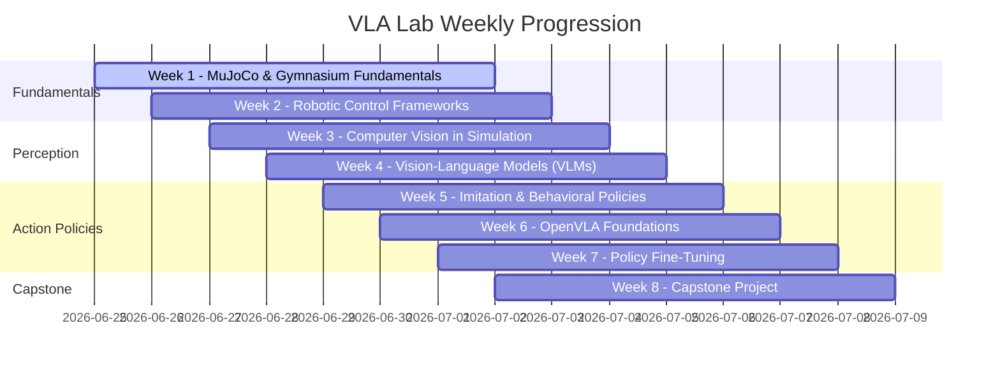

# VLA Lab Learning Roadmap

This document outlines the week-by-week curriculum of the **VLA (Vision-Language-Action) Learning Lab**, showing the progression from low-level physics simulation to advanced fine-tuning of multi-modal embodied policies.

---

## 8-Week Curriculum

---

## Weekly Breakdown

### Week 1: MuJoCo and Gymnasium Fundamentals (Current)
- **Goal**: Understand physics solvers, step functions, observations, actions, and basic control theory.
- **Topics**: MjModel vs MjData, Gymnasium environment loops, Reacher-v5 kinematics, torque control dynamics, Transpose Jacobian feedback control, random and fixed policies, exploration vs exploitation, and policy performance comparisons.

### Week 2: Robotic Control Frameworks
- **Goal**: Design precise joint-space and Cartesian-space trajectory tracking.
- **Topics**: Proportional-Integral-Derivative (PID) controllers, Operational Space Control (OSC), inverse dynamics, and gravity compensation.

### Week 3: Computer Vision in Simulation
- **Goal**: Integrate cameras, extract RGB-D images, and handle coordinate projections.
- **Topics**: MuJoCo camera rendering, camera matrix calibration, point clouds, and object detection.

### Week 4: Vision-Language Models (VLMs)
- **Goal**: Use VLMs to generate semantic descriptions and parse spatial instructions.
- **Topics**: Vision-Language prompting, visual grounding, predicting coordinates from language, and open-vocabulary detector models.

### Week 5: Imitation and Behavioral Policies
- **Goal**: Train robotic agents from expert demonstration data.
- **Topics**: Dataset collection, Behavior Cloning (BC), MLP/ResNet action heads, and evaluation metrics.

### Week 6: OpenVLA Foundations
- **Goal**: Explore pre-trained Vision-Language-Action foundation models.
- **Topics**: OpenVLA architecture, tokenizing actions, visual features extraction, and zero-shot simulation evaluation.

### Week 7: Policy Fine-Tuning
- **Goal**: Fine-tune OpenVLA on a target manipulation task.
- **Topics**: Parameter-Efficient Fine-Tuning (PEFT/LoRA), dataset formatting, training hyperparameters, and evaluation.

### Week 8: Capstone Project
- **Goal**: Deploy a full VLA control loop in simulation.
- **Topics**: Task design, multi-stage instruction execution, visual feedback, performance testing, and open-source project write-up.
