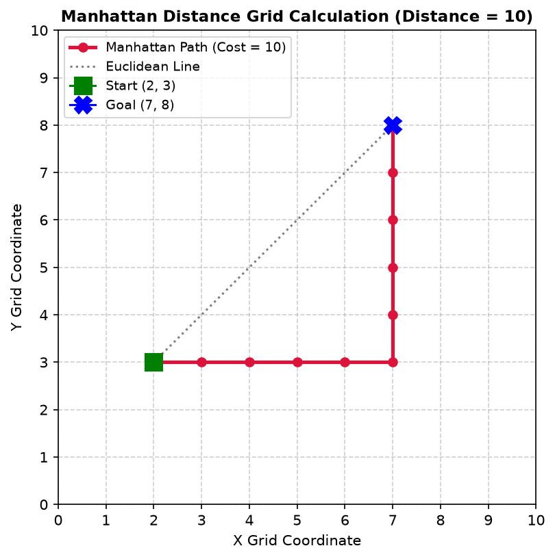
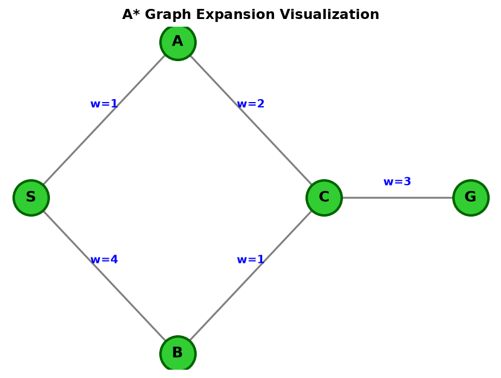

# Day 13 Journal: A* Path Planning and Heuristic Search

- **Date**: 2026-07-21
- **Author**: Vishrao
- **Milestone**: Day 13 of VLA Learning Lab

---

## Learning Objectives
1. Understand the theoretical foundations of heuristic search and priority queue node selection.
2. Formulate the A* cost evaluation function $f(n) = g(n) + h(n)$.
3. Implement and calculate Manhattan ($L_1$ norm) distance heuristics for 4-connected grid spaces.
4. Execute A* search on directed weighted graphs using Python's `heapq` module.
5. Contrast uninformed BFS / Dijkstra search with heuristic-guided A* search across varying heuristic weights.
6. Detail the role of global path planners in modern Vision-Language-Action (VLA) robotics architectures.

---

## Review of BFS
Breadth-First Search (BFS) is an uninformed graph search algorithm that expands nodes uniformly level-by-level using a FIFO queue. While BFS guarantees finding the shortest path on unweighted graphs, it expands in all directions symmetrically (circular wavefront), making it computationally expensive and memory-intensive in large grids.

---

## Why Heuristics Matter
Uninformed algorithms explore blindly because they have no spatial knowledge of where the goal is located relative to candidate nodes. A **Heuristic** $h(n)$ provides an estimate of the remaining cost from node $n$ to the goal, steering node expansion toward the target and pruning unpromising branches.

---

## A* Algorithm Overview & Cost Function
A* evaluates candidate nodes using:

$$f(n) = g(n) + h(n)$$

- **$g(n)$**: The exact accumulated cost from the start node to node $n$.
- **$h(n)$**: The heuristic estimated cost from node $n$ to the goal node.
- **$f(n)$**: The estimated total cost of the path passing through node $n$.

---

## Manhattan Distance
For grid navigation restricted to 4 orthogonal directions (Up, Down, Left, Right) with step cost 1:

$$d_{\text{Manhattan}}(\mathbf{a}, \mathbf{b}) = |x_1 - x_2| + |y_1 - y_2|$$

Manhattan distance provides an **admissible** (never overestimates) and **consistent** heuristic for grid path planning.

---

## Priority Queue
In A*, the **Open Set** is implemented using a Min-Heap priority queue (`heapq`). Candidate states are pushed as `(f_score, g_score, node)`. The heap automatically pops the unvisited node with the lowest $f(n)$ value in $O(\log N)$ time.

---

## Lab Results

### Lab 29: Manhattan Distance Heuristic
- **Setup**: Computed Manhattan distance between $START = (2, 3)$ and $GOAL = (7, 8)$.
- **Command**: `python week02/lab29_manhattan_distance.py`
- **Output**:
  ```text
  ==================================================
  Manhattan Distance
  ==================================================
  Start : (2, 3)
  Goal  : (7, 8)
  Distance = 10
  ```
- **Plot**:
  

### Lab 30: A* Search Demonstration
- **Setup**: Solved shortest path on a directed weighted graph connecting node `S` to `G`.
- **Command**: `python week02/lab30_astar_planner.py`
- **Output**:
  ```text
  ==================================================
  Starting Lab 30: Simple A* Demonstration
  ==================================================
  Visiting S
  Visiting A
  Visiting C
  Visiting B
  Visiting G
  ```
- **Plot**:
  

---

## Exercise Analysis

### Exercise 1: Inadmissible Heuristic ($h(A) = 10$)
- **Modification**: Increased $h(A)$ from $0 \to 10$.
- **Observation**:
  - From `S`, candidate `A` has $f(A) = g(A) + h(A) = 1 + 10 = 11$.
  - Candidate `B` has $f(B) = g(B) + h(B) = 4 + 0 = 4$.
  - The priority queue pops `B` first ($f=4$) instead of `A` ($f=11$).
  - Search proceeds: `Visiting S` $\to$ `Visiting B` $\to$ `Visiting C` $\to$ `Visiting G`.
  - **Node `A` is never visited!**
- **Conclusion**: Overestimating heuristics penalizes optimal branches, causing A* to explore suboptimal paths or miss the shortest path entirely.

### Exercise 2: Zero Heuristic ($h(n) = 0$ for all $n$)
- **Modification**: Set every heuristic value to zero.
- **Observation**: $f(n) = g(n) + 0 = g(n)$.
- **Conclusion**: A* reduces exactly to **Dijkstra's Algorithm**. Nodes are popped strictly in order of increasing distance $g(n)$ from the start.

### Exercise 3: Perfect Heuristic ($h(n) = h^*(n)$)
- **Modification**: Set $h(n)$ to the exact remaining cost ($h(G)=0, h(C)=3, h(A)=5, h(B)=4, h(S)=6$).
- **Observation**: $f(n) = C^*$ (optimal path cost) for all nodes on the optimal path.
- **Conclusion**: A* explores the **minimum possible number of nodes**, moving directly along the optimal path without evaluating off-path nodes.

---

## BFS vs. A* & Dijkstra Relationship
- **BFS**: Uninformed search for unweighted graphs. Expands level-by-level using a FIFO queue.
- **Dijkstra**: Uninformed search for weighted graphs ($f=g$). Expands using a priority queue.
- **A***: Informed search using $f = g + h$. Directs expansion toward goal while maintaining optimality if $h$ is admissible.

---

## Where A* Is Used
- **ROS Navigation Stack (Nav2)**: Global path planning for mobile autonomous robots.
- **MoveIt Motion Planning**: Cartesian and joint space path finding for robotic manipulators.
- **Autonomous Vehicles**: Hybrid A* for parking maneuvers and lane trajectory planning.
- **Warehouse AGVs**: Multi-agent route planning in automated fulfillment centers.
- **Drone Navigation**: 3D grid path generation around terrain and buildings.
- **Game AI**: Character navigation and pathfinding in RTS and RPG video games.
- **Mars Rovers**: Autonomous path finding over rocky planetary terrain (NASA Curiosity / Perseverance).

---

## VLA Connection

```text
 1. User Instruction ("pick up the red mug on the table")
        │
        ▼
 2. Vision (RGB-D Cameras, Point Cloud Occupancy Mapping)
        │
        ▼
 3. Language Understanding (Vision-Language Model / VLM)
        │
        ▼
 4. Task Planner (Generates high-level coordinate targets)
        │
        ▼
 5. A* Motion Planner (Generates collision-free geometric waypoints around barriers)
        │
        ▼
 6. Trajectory Generator (Applies trapezoidal speed profiles over time)
        │
        ▼
 7. Inverse Kinematics (IK) (Translates Cartesian points into target joint angles theta_d)
        │
        ▼
 8. PID Controller (Runs at 1 kHz to drive joint motor currents)
        │
        ▼
 9. Motor Drivers ──► Physical Robot Motion
```

A* is specifically responsible for **geometric obstacle avoidance**, ensuring that high-level language commands are executed along safe paths without needing the deep VLM neural network to reason about low-level spatial collision geometry.

---

## Commands Used
```bash
# Run Manhattan distance calculator & plotter
python week02/lab29_manhattan_distance.py

# Run A* graph search demonstration & plotter
python week02/lab30_astar_planner.py
```

---

## Issues Encountered & Solutions
- None. Both scripts executed cleanly and generated visual artifacts in `assets/day13/`.

---

## Glossary & Interview Links
- Glossary terms added to [docs/glossary.md](file:///C:/Users/Vishrao/vla-lab/vla-lab/docs/glossary.md).
- Q&As added to [docs/interview_questions.md](file:///C:/Users/Vishrao/vla-lab/vla-lab/docs/interview_questions.md).

---

## Reflection
Heuristics transform blind graph search into focused navigation. Maintaining admissible heuristics ensures optimal pathfinding while reducing search overhead.

---

## Next Steps
Day 14: Implement a full grid-based A* planner in Python with path reconstruction, search visualization, admissible vs. consistent heuristics comparison, and performance benchmarks against BFS and Dijkstra.
