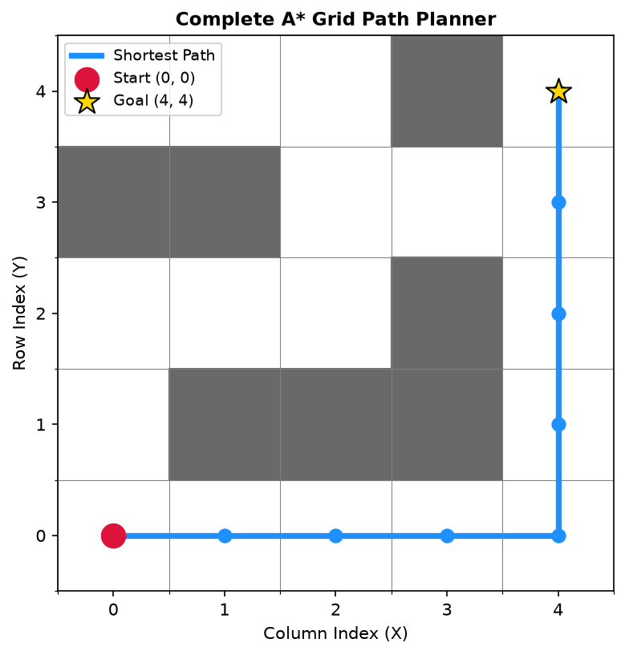
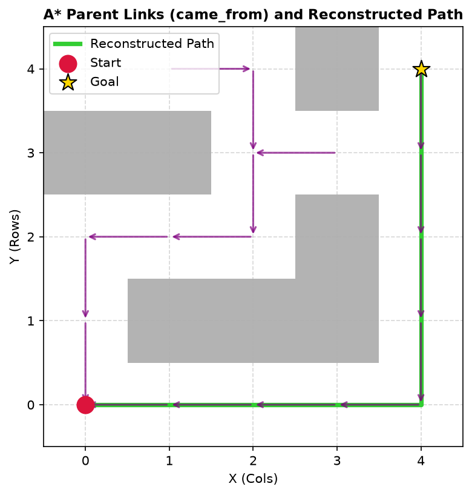
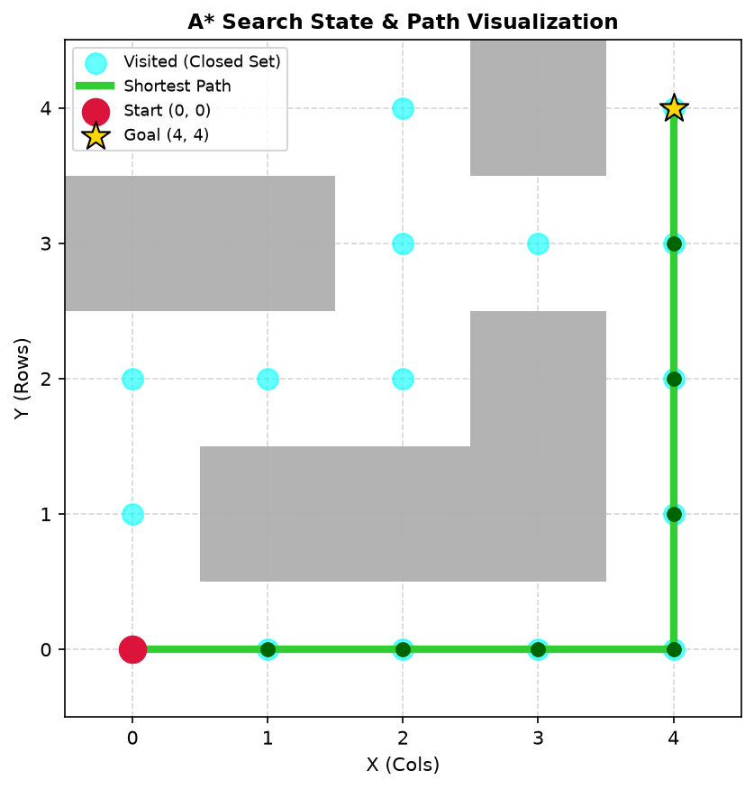

# Day 14 Journal: Complete A* Path Planning and Visualization

- **Date**: 2026-07-21
- **Author**: Vishrao
- **Milestone**: Day 14 of VLA Learning Lab

---

## Learning Objectives
1. Implement a complete grid-based A* (A-Star) search solver in Python.
2. Structure Open Set priority queues, Closed Set hash tables, g-scores, and f-scores.
3. Manage parent tracking using a `came_from` mapping dictionary and execute iterative path reconstruction.
4. Render high-resolution grid visualizations displaying obstacles, free space, visited frontiers, and shortest paths.
5. Contrast performance parameters between BFS, Dijkstra's algorithm, and A* search.
6. Detail how global path planners integrate into ROS Nav2 and Vision-Language-Action (VLA) navigation architectures.

---

## Review of A* & Why Yesterday's Version Was Simplified
Yesterday (Day 13), we demonstrated A* on a 5-node abstract directed graph without grid coordinates or parent backtracking, storing simple `(f, node)` tuples. Today (Day 14), we expanded A* into a full 2D occupancy grid solver that maintains explicit $g(n)$ scores, candidate parent links (`came_from`), and backtracking loops.

---

## Open Set vs. Closed Set
- **Open Set**: A min-heap priority queue (`heapq`) storing candidate nodes `(f_score, node)` awaiting expansion.
- **Closed Set**: A hash set (`set()`) tracking visited nodes to prevent redundant re-expansions.

---

## g-score vs. f-score & Parent Tracking
- **g-score ($g(n)$)**: Actual movement cost accumulated from start to node $n$.
- **f-score ($f(n)$)**: Total estimated score $f(n) = g(n) + h(n)$ used to prioritize queue expansion.
- **`came_from` Dictionary**: Maps `came_from[neighbor] = current` whenever a cheaper $g$-score is found.

---

## Path Reconstruction Procedure
When `current == goal`, the planner stops searching and backtracks:
```text
Goal (4,4) ──► Parent (3,4) ──► Parent (2,4) ──► ... ──► Start (0,0)  ==Reversed==►  Full Path
```

---

## Lab Results

### Lab 31: Complete Grid A* Planner
- **Setup**: Solved shortest path on a 5x5 grid map from `(0,0)` to `(4,4)`.
- **Command**: `python week02/lab31_astar_grid.py`
- **Output**:
  ```text
  Shortest Path:
  (0, 0) -> (0, 1) -> (0, 2) -> (0, 3) -> (0, 4) -> (1, 4) -> (2, 4) -> (3, 4) -> (4, 4)
  ========================================
  A* Search Complete
  ========================================
  Start : (0, 0)
  Goal  : (4, 4)
  Goal Reached : True
  Visited Nodes: 16
  Discovered Nodes: 17
  ```
- **Plot**:
  

### Lab 32: Path Reconstruction Mechanics
- **Setup**: Verified parent link tracking and printed step-by-step backtracking statements.
- **Command**: `python week02/lab32_astar_reconstruction.py`
- **Output**:
  ```text
  Parent Tracking (Backtracking Step-by-Step):
  ---------------------------------------------
  Node (4, 4) <-- came from Parent (3, 4)
  Node (3, 4) <-- came from Parent (2, 4)
  ...
  Node (0, 1) <-- came from Parent (0, 0)
  ```
- **Plot**:
  

### Lab 33: A* Search Visualization
- **Setup**: Standalone color-coded grid visualizer rendering open/closed sets, obstacles, and shortest path.
- **Command**: `python week02/lab33_astar_visualization.py`
- **Plot**:
  

---

## Exercise Results & Observations

### Exercise 1: Adding Extra Obstacles
- **Observation**: Adding obstacles at `(0, 1)` and `(0, 2)` forces A* to divert downward through row 1 and row 2.
- **Explanation**: A* dynamically updates neighbor $g$-scores and evaluates alternative paths around barriers without getting trapped in dead ends.

### Exercise 2: Goal Location Shift (Goal = `(0, 4)`)
- **Observation**: Shifting the goal reduces the path length to 4 straight horizontal steps: `(0,0) -> (0,1) -> (0,2) -> (0,3) -> (0,4)`.
- **Explanation**: The Manhattan heuristic $h(n) = |x_n - 0| + |y_n - 4|$ pulls node expansion directly along row 0 toward column 4.

### Exercise 3: Zero Heuristic ($h(n) = 0$)
- **Observation**: Setting $h(n) = 0$ increases the number of visited nodes from $16 \to 21$.
- **Explanation**: A* degrades into **Dijkstra's Algorithm**, expanding nodes uniformly in circular waves rather than focusing towards the goal.

---

## BFS vs. Dijkstra vs. A* Comparison

| Feature | BFS | Dijkstra | A* |
| :--- | :--- | :--- | :--- |
| **Data Structure** | FIFO Queue (`deque`) | Priority Queue (`heapq`) | Priority Queue (`heapq`) |
| **Evaluation Metric** | Step depth | $g(n)$ (Accumulated cost) | $f(n) = g(n) + h(n)$ |
| **Edge Costs** | Uniform ($c=1$) | Non-negative ($c \ge 0$) | Non-negative ($c \ge 0$) |
| **Heuristic Guidance**| None | None | Informed ($h(n)$) |
| **Visited States** | High (circular wave) | High (uniform cost expansion) | Minimal (goal-focused) |

---

## How Modern Robots Plan Paths
- **ROS Nav2**: Uses A* or Dijkstra as global planners to route mobile robots around static obstacles.
- **MoveIt**: Uses sampling-based (RRT*) or grid search for manipulator arm trajectory planning.
- **Warehouse AMRs & AGVs**: Multi-agent A* routes thousands of robots in Amazon / Ocado fulfillment centers.
- **Autonomous Vehicles**: Hybrid A* plans kinematic vehicle paths respecting turning radius constraints.
- **Mars Rovers**: Autonomous path generation across hazardous terrain (NASA Curiosity / Perseverance).
- **Drones**: 3D occupancy grid A* planning around buildings and trees.

---

## VLA Connection

```text
 1. User Instruction ("bring the red box to the kitchen counter")
        │
        ▼
 2. Vision Model (RGB-D Cameras, Point Cloud Occupancy Mapping)
        │
        ▼
 3. Language Model (VLM Intent Resolution)
        │
        ▼
 4. Task Planner (High-level sub-goal decomposition)
        │
        ▼
 5. Global Planner (A*) (Calculates collision-free global path waypoints)
        │
        ▼
 6. Local Planner (DWA / TEB real-time dynamic obstacle avoidance)
        │
        ▼
 7. Trajectory Generator (Time parameterization & smooth speed profiling)
        │
        ▼
 8. Inverse Kinematics (IK) (Joint setpoint conversion)
        │
        ▼
 9. PID Controller (High-frequency torque regulation)
        │
        ▼
10. Motor Drivers ──► Physical Robot Motion
```

---

## Commands Used
```bash
# Run grid A* path planner
python week02/lab31_astar_grid.py

# Run path reconstruction demo
python week02/lab32_astar_reconstruction.py

# Run A* visualization demo
python week02/lab33_astar_visualization.py
```

---

## Glossary & Interview Links
- Glossary terms added to [docs/glossary.md](file:///C:/Users/Vishrao/vla-lab/vla-lab/docs/glossary.md).
- Q&As added to [docs/interview_questions.md](file:///C:/Users/Vishrao/vla-lab/vla-lab/docs/interview_questions.md).

---

## Reflection
Parent tracking using `came_from` decoupling allows memory-efficient path reconstruction. Combining priority queues with admissible heuristics makes A* the gold standard for global grid navigation.

---

## Next Steps
Day 15: Introduction to Rapidly-exploring Random Trees (RRT), sampling-based motion planning in high-dimensional configuration spaces (C-space), and why RRT is preferred over grid search for robot manipulators.
